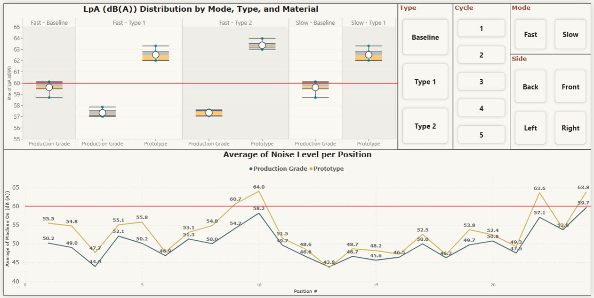
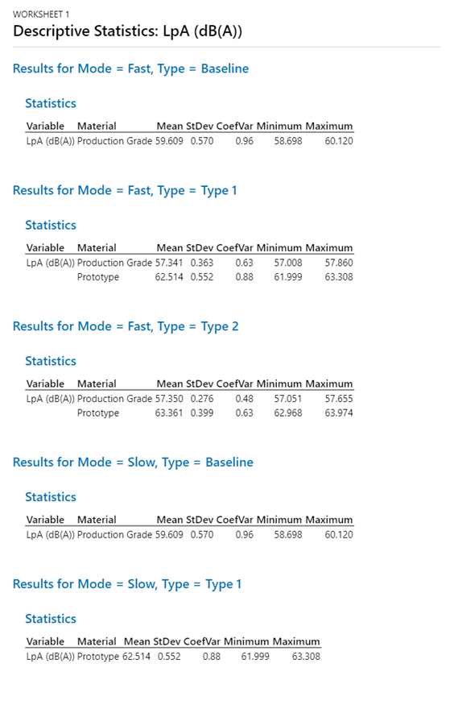
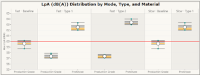
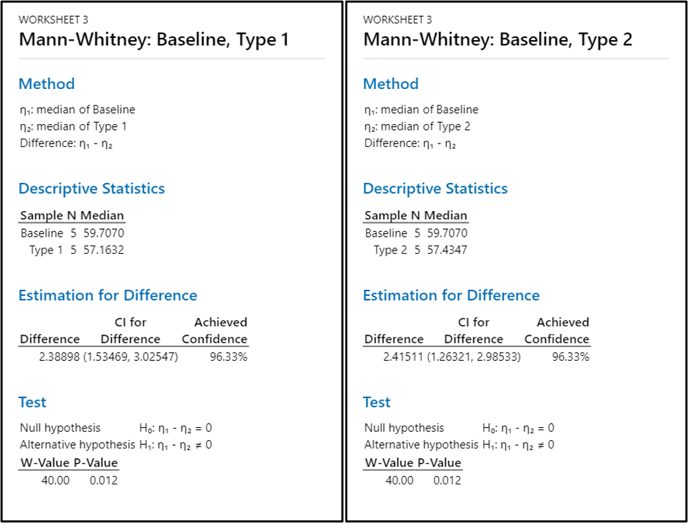

# Acoustic Test Data Analytics

## 1. Project Overview

This project analyzes acoustic performance test data to compare noise levels across different operating modes, design types, and material variants. LpA (dB(A)) values were calculated and processed in Microsoft Excel before being analyzed using an interactive Power BI dashboard, which visualizes noise distributions, compares average noise levels by measurement position, and evaluates compliance with the 60 dB(A) engineering target. Statistical analysis and validation were performed using Minitab.

**Tools:** Microsoft Excel, Power BI, Power Query, DAX, Minitab

---

## 2. Dashboard Overview

  

---

## 3. Questions

  
- Are the acoustic measurements consistent across repeated test cycles?
- How do operating modes influence acoustic performance?
- How do design types and material variants compare in terms of noise performance?
- Which configuration demonstrates the most consistent acoustic performance?
- Which measurement positions contribute the highest acoustic noise?
- How does the best-performing configuration statistically compare with the baseline configuration?

---

## 4. Data Preparation

| Step | Description |
|------|-------------|
| **Data Source** | Collected raw acoustic measurement data from sound performance testing across multiple operating modes, design types, material variants, measurement positions, and test cycles. |
| **Data Cleaning** | Used Power Query to correct data types, remove unnecessary columns, handle blank values, and validate measurement records to ensure data consistency prior to analysis. |
| **Data Transformation** | Calculated A-weighted sound pressure levels (**LpA dB(A)**) in Microsoft Excel, then used Power Query to reshape and organize the dataset into a structured format suitable for visualization and statistical analysis. |
| **Data Standardization** | Standardized operating modes, design types, material variants, measurement positions, and test identifiers to ensure consistent classification and comparison across all test configurations. |
| **Data Integration** | Consolidated acoustic measurement results from multiple test configurations into a unified, analysis-ready dataset to support comparative analysis and interactive reporting. |
| **Output** | Produced a clean, structured, and analysis-ready dataset to support acoustic performance evaluation, engineering validation, statistical analysis, and interactive Power BI dashboard reporting. |

---

## 5. Data Validation

  
**Objective:** Verify that the acoustic measurement records displayed in the Power BI dashboard match the transformed dataset.

**Validation:** Compared the filtered LpA (dB(A)) values and records in the Power BI dashboard with the transformed dataset using identical Mode, Type, Cycle, Side, and Material filters.

**Result:** All filtered records and LpA values matched, confirming that the Power Query transformations and dashboard calculations accurately represent the source data.

**Steps:**

1. Apply the desired dashboard filters.
2. Verify the displayed LpA (dB(A)) values and records in Power BI.
3. Apply the same filters to the transformed dataset.
4. Confirm that the filtered records and LpA values match the dashboard.

  

---

## 6. Dashboard & Analysis

| Dashboard and Statistical Visual | Business Question | Focus |
|----------------------------------|-------------------|-------|
| **Descriptive Statistics (Coefficient of Variation)** | Are the acoustic measurements consistent across repeated test cycles? | Evaluates the repeatability of **LpA (dB(A))** measurements using descriptive statistics and the **Coefficient of Variation (CV)**. Low CV values indicate consistent and reliable measurements across repeated acoustic tests. |
| **LpA (dB(A)) Distribution** | • How do operating modes influence acoustic performance? • How do design types and material variants compare in terms of noise performance? • Which configuration demonstrates the most consistent acoustic performance? | Compares the distribution, central tendency, and variability of **LpA (dB(A))** measurements across operating modes, design types, and material variants to identify quieter and more consistent test configurations. |
| **Average Noise Level by Position** | Which measurement positions contribute the highest acoustic noise? | Visualizes average **LpA (dB(A))** across measurement positions to identify locations with consistently higher noise levels and compare acoustic performance between test configurations. |
| **Mann–Whitney U Test** | How does the best-performing configuration statistically compare with the baseline configuration? | Compares the **LpA (dB(A))** measurements of the best-performing configuration with the baseline configuration using the **Mann–Whitney U test** to determine whether the observed reduction in acoustic noise is statistically significant. |

---

## 7. Key Findings

| Business Question | Dashboard Visual | Conclusion |
|-------------------|------------------|------------|
| **Are the acoustic measurements consistent across repeated test cycles?** |  | All test configurations exhibited low coefficients of variation (**CV < 1%**), indicating excellent repeatability and consistency of **LpA (dB(A))** measurements across repeated test cycles. These results demonstrate minimal measurement variability, providing a reliable basis for subsequent statistical comparison and acoustic performance evaluation. |
| **How do operating modes influence acoustic performance?** |  | Fast mode produced slightly higher noise levels than Slow mode across most test configurations. As required by the acoustic test standard, Fast mode was used as the primary condition for evaluating compliance with the **60 dB(A)** engineering target. |
| **How do design types and material variants compare in terms of noise performance?** |  | Design types exhibited comparable acoustic performance regardless of material variant. However, all production-grade configurations met the **60 dB(A)** acoustic target, whereas prototype configurations consistently exceeded the specification, indicating that prototype materials are not suitable for acoustic performance validation. |
| **Which configuration demonstrates the most consistent acoustic performance?** |  | Fast mode with **Type 1** and **Type 2 production-grade** configurations demonstrated the most consistent acoustic performance, achieving lower noise levels than the baseline while consistently meeting the **60 dB(A)** acoustic target. |
| **Which measurement positions contribute the highest acoustic noise?** | 
      
 | Measurement Positions **10, 22, and 24** consistently exhibited the highest acoustic noise across all test configurations. Prototype materials produced substantially higher noise levels than production-grade materials at these positions, with **Position 24** recording the highest **LpA (dB(A))** values overall. |
| **How does the best-performing configuration statistically compare with the baseline configuration?** |  | Mann–Whitney U tests confirmed that both **Type 1** and **Type 2 production-grade** configurations achieved statistically significant reductions in **LpA (dB(A))** compared with the **Fast-mode baseline** (**p = 0.012** for both comparisons). These results support the engineering recommendation to adopt the **Type 1** and **Type 2 production-grade** configurations for acoustic validation testing. |

---

## 8. Recommendations

| Recommendation | Rationale |
|----------------|-----------|
| **Use production-grade components for acoustic performance validation.** | Prototype materials consistently exceeded the **60 dB(A)** acoustic target, making them unsuitable for representative acoustic testing. |
| **Prioritize Type 1 and Type 2 production-grade configurations for future design iterations.** | These configurations achieved lower noise levels than the baseline while consistently meeting the acoustic performance target. |
| **Focus noise reduction efforts on measurement Positions 10, 22, and 24.** | These positions consistently recorded the highest **LpA (dB(A))** values across all test configurations, indicating the primary sources of acoustic emissions. |
| **Continue evaluating acoustic performance using Fast mode.** | Fast mode consistently recorded slightly higher noise levels and is the required operating condition for compliance with the acoustic test standard. |

---

## 9. Skills Demonstrated

| Skill Area | Tools / Techniques |
|------------|--------------------|
| **Data Collection** | Microsoft Excel, Acoustic Test Data Collection |
| **Data Cleaning** | Power Query, Data Type Correction |
| **Data Transformation** | Microsoft Excel, LpA (dB(A)) Calculation, Power Query M, Custom Transformations |
| **Data Integration** | Data Consolidation, Test Configuration Integration |
| **Data Standardization** | Operating Mode Standardization, Design Type Classification, Material Variant Standardization, Measurement Position Standardization |
| **Data Modeling** | DAX Calculated Columns, Data Relationships |
| **Data Validation** | Source-to-Dashboard Reconciliation, LpA Value Verification, Dashboard Consistency Verification |
| **Data Analysis** | Acoustic Performance Analysis, Noise Distribution Analysis, Measurement Position Analysis, Compliance Assessment, Statistical Analysis (Minitab) |
| **Data Visualization** | Power BI Dashboard, Box-and-Whisker Plot, Line Chart, Reference Line, Slicers, Cross-filtering |
